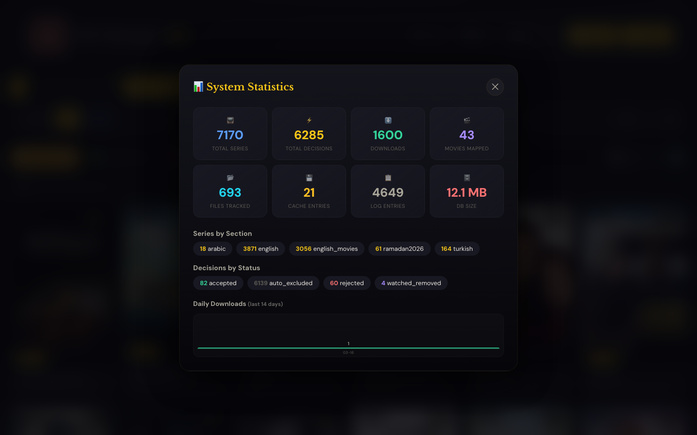
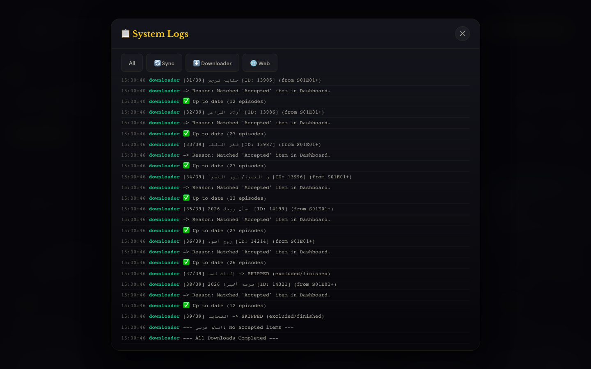
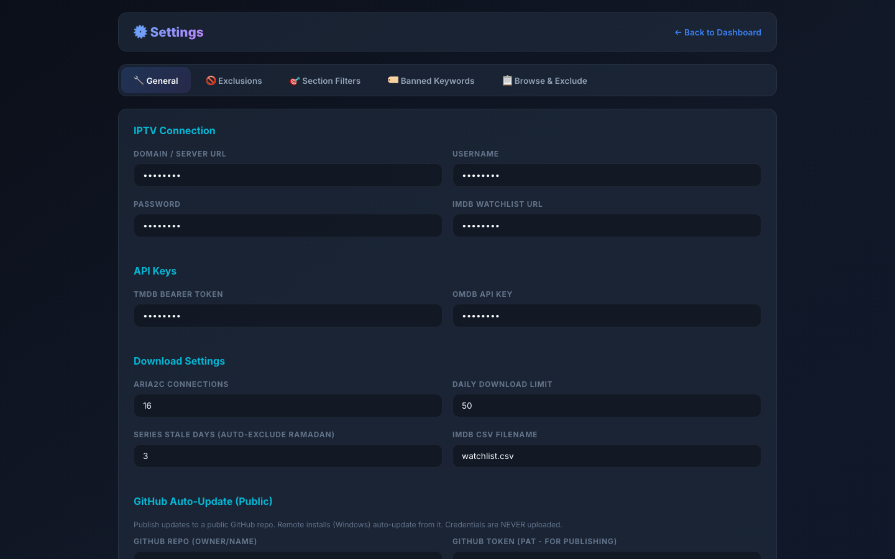
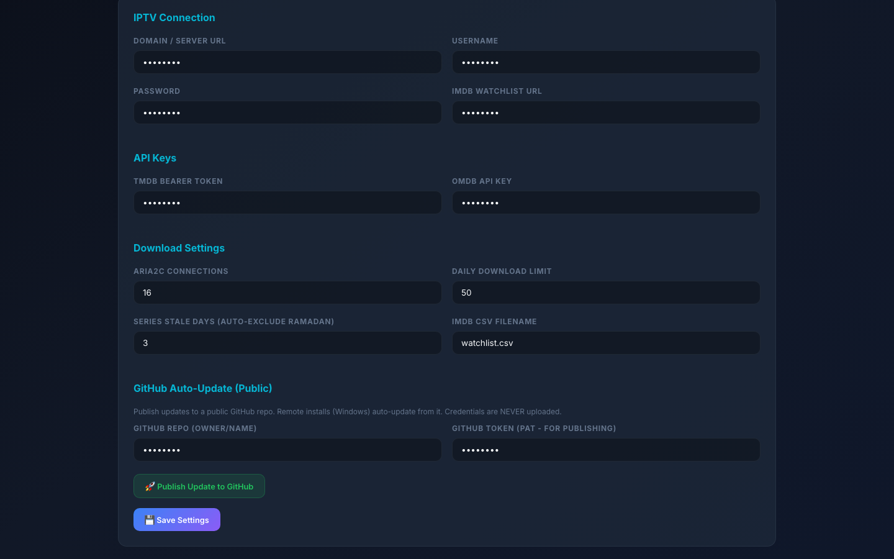
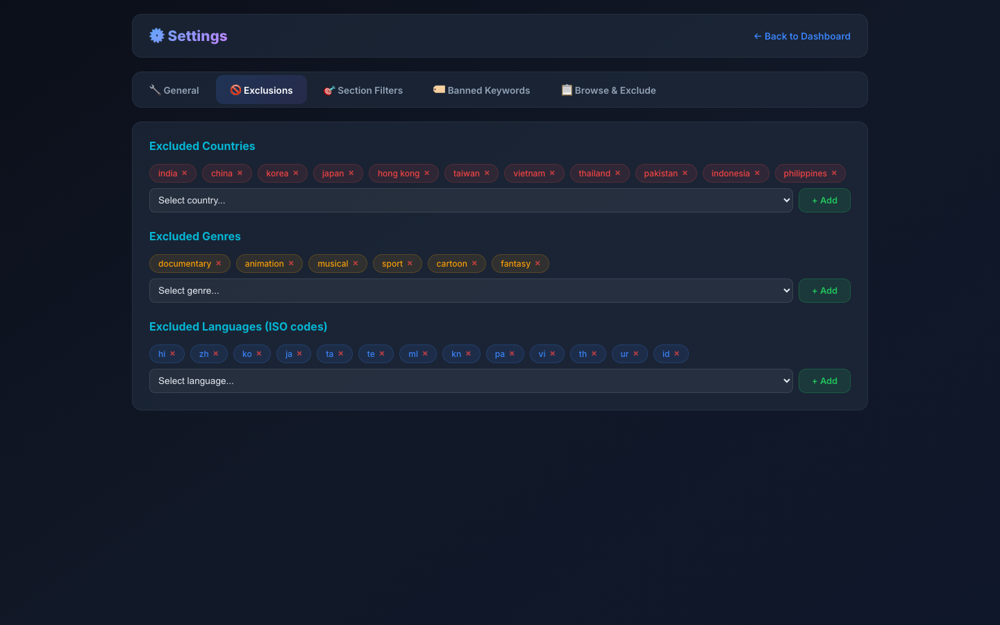
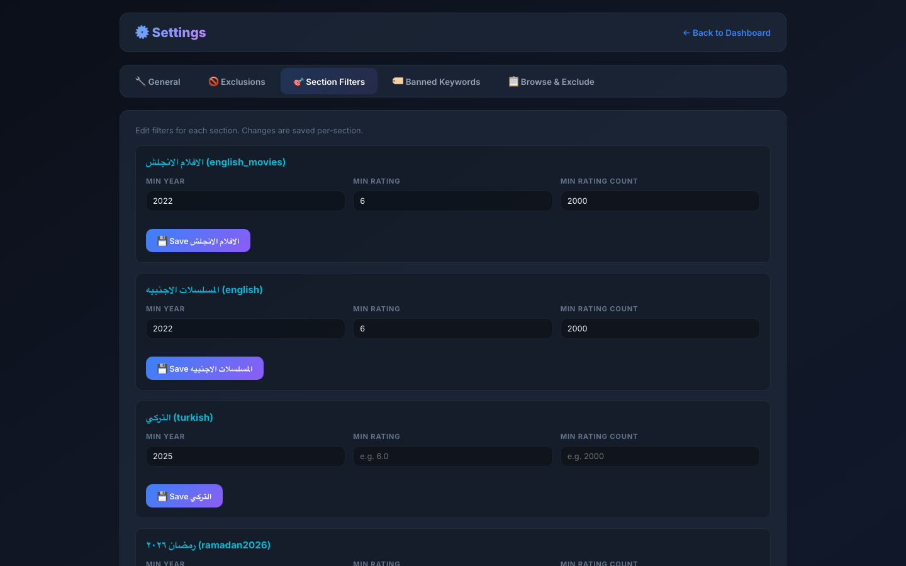
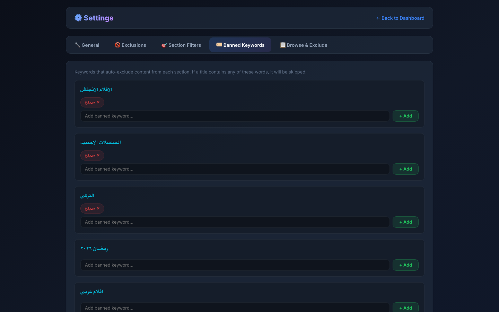
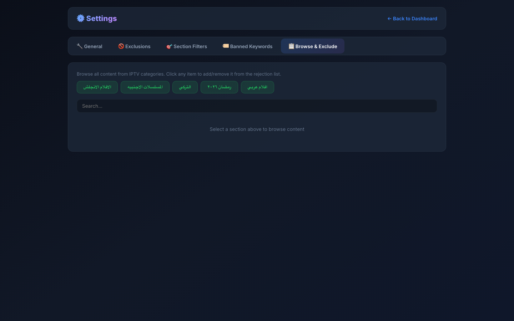

<div align="center">

# IPTV Manager

### A Complete IPTV Series & Movies Management System

[]()
[]()
[]()
[]()

**Automatically discovers, organizes, and downloads series & movies from your IPTV provider with a beautiful dark-themed web dashboard.**

</div>

---

## Screenshots

### Main Dashboard
The primary interface for managing your media library. Displays movie and series posters in a grid layout with IMDB ratings, vote counts, genre tags, and country metadata. Content is organized by sections (Arabic, English, Turkish, Ramadan, etc.) with live item counts per section.


### Content Review (Pending Queue)
All newly discovered content from your IPTV provider lands here first. Each item can be individually accepted for download or rejected. The pending queue ensures you have full control over what gets downloaded to your library.


### System Toolbar
The extended toolbar provides quick access to core operations: **Kill All** (stop all running processes), **Sync Now** (trigger immediate IPTV catalog sync), **Start Download** (begin downloading accepted content), and **System Check** (verify all services are healthy). The toolbar appears when the **System** button is activated.


### System Statistics
A comprehensive overview of your entire library with real-time metrics:
- **Total Series** — number of tracked series across all sections
- **Total Decisions** — cumulative accept/reject/exclude actions taken
- **Downloads** — total completed downloads
- **Movies Mapped** — movies matched with metadata from TMDB/OMDb
- **Files Tracked** — individual episode and movie files monitored
- **Cache Entries** — metadata cache size for faster lookups
- **Log Entries** — total system log records
- **DB Size** — current SQLite database size
- **Series by Section** — breakdown per content category
- **Decisions by Status** — distribution of accepted, excluded, rejected, and watched items
- **Daily Downloads** — download activity chart for the last 14 days



### System Logs
Real-time log viewer with four dedicated tabs:
- **All** — combined view of all system events
- **Sync** — IPTV catalog synchronization logs showing discovered and updated content
- **Downloads** — aria2c download progress, completion, and error logs
- **Errors** — filtered view of warnings and failures for quick troubleshooting



---

## Settings

The Settings panel is a dedicated page with five specialized tabs for complete system configuration.

### General Settings
Core configuration for connecting to your IPTV provider and external services:
- **IPTV Connection** — Server URL, username, and password for your IPTV provider's Xtream API
- **IMDb Watchlist URL** — Link to your public IMDb watchlist for automatic content matching
- **API Keys** — TMDB Bearer Token (for posters, metadata, and ratings) and OMDb API Key (for additional ratings and plot info)
- **Download Settings** — aria2c parallel connections (1-64), daily download limit, series stale days for auto-excluding inactive Ramadan series, and IMDb CSV filename
- **GitHub Auto-Update** — Repository and token for publishing updates to a public GitHub repo (credentials are never uploaded)



### Download Configuration
Fine-tune the download engine:
- **aria2c Connections** — Number of parallel connections per download (default: 16). Higher values improve speed but increase server load
- **Daily Download Limit** — Maximum number of episodes/movies to download per day. Prevents bandwidth saturation and IPTV provider rate-limiting
- **Series Stale Days** — Number of days after which a Ramadan series with no new episodes is automatically excluded
- **IMDb CSV Filename** — Name of the exported IMDb watchlist CSV file for batch import



### Exclusions
Global exclusion rules that apply across all sections. Content matching any of these rules is automatically skipped during sync:
- **Excluded Countries** — Block all content from specific countries (e.g., India, China, Korea). Uses country metadata from TMDB
- **Excluded Genres** — Skip unwanted genres globally (e.g., Documentary, Animation, Musical, Sport). Matched against TMDB genre tags
- **Excluded Languages** — Filter out content by original language using ISO 639-1 codes (e.g., hi, zh, ko, ja)

Each exclusion list supports dropdown selection from all values found in your existing library, making it easy to discover and block unwanted content.



### Section Filters
Per-section quality gates that control which content enters the pending queue:
- **Min Year** — Only include content released after this year (e.g., 2022)
- **Min Rating** — Minimum IMDB/TMDB rating threshold (e.g., 6.0)
- **Min Rating Count** — Minimum number of votes required (e.g., 2000). Prevents low-confidence ratings from passing the filter

Each section (English Movies, English Series, Turkish, Ramadan, etc.) has independent filter settings, allowing different quality thresholds for different content types.



### Banned Keywords
Keyword-based exclusion rules applied per section:
- **Banned Keywords** — If any word in a title matches a banned keyword, the content is automatically excluded during sync and never appears in the dashboard
- **Pre-Rejected Keywords** — Similar to banned keywords, but content is marked as "rejected" in the dashboard instead of being completely hidden. Useful for content you want to track but not download

Each section has its own independent keyword list, giving you granular control over content filtering.



### Browse & Exclude
A visual browser for all content available from your IPTV provider's categories:
- Select a section to load all available titles with poster thumbnails
- Search and filter by name
- Click any item to instantly add or remove it from the exclusion list
- Excluded items are visually marked with a red badge

This feature is particularly useful for bulk-excluding unwanted content that passes other filters.



---

## Features

| Feature | Description |
|---------|-------------|
| **Web Dashboard** | Modern dark-themed UI with movie posters, IMDB ratings, vote counts, genres, and country metadata displayed in a responsive grid layout |
| **Auto-Discovery** | Connects to your IPTV provider via Xtream API and automatically discovers new series and movies across all configured categories |
| **Smart Downloads** | Downloads new episodes and movies automatically via aria2c with configurable parallel connections (up to 64) and daily download limits |
| **Metadata & Posters** | Fetches high-quality cover art, plot summaries, ratings, genres, country, and language data from both TMDB and OMDb APIs |
| **Accept/Reject System** | All new content goes through a review queue. Accept to download, reject to skip, or let filters handle it automatically |
| **Multi-Section Support** | Organize content by categories: Arabic Series, Turkish Series, English Series, English Movies, Ramadan Specials, and more |
| **Auto-Update** | Windows and Linux installations auto-check this GitHub repo every 5 minutes and apply updates seamlessly |
| **System Tray (Windows)** | Tray icon with full server controls, status indicators (green = running, red = stopped), watchdog auto-restart, and Windows startup integration |
| **Push Notifications** | Browser push notifications via Service Worker (PWA) when downloads complete or important events occur |
| **Search & Filter** | Real-time search by title or genre, status filters (Pending, Accepted, Rejected, Watched, Excluded), and sort options |
| **Download Monitor** | Real-time sync and download logs with categorized tabs (All, Sync, Downloads, Errors) for full visibility |
| **IMDB Integration** | Import your IMDB watchlist (via URL or CSV) for automatic matching — accepted content from your watchlist gets priority |
| **Content Exclusion Engine** | Multi-layer filtering: by country, genre, language, keywords, rating thresholds, year, vote count, and per-title exclusion |
| **Section Filters** | Independent quality gates per section with configurable minimum year, rating, and vote count thresholds |
| **Statistics Dashboard** | Comprehensive system metrics including library size, download history, decision breakdown, and daily activity charts |

---

## Installation

### Windows (Recommended)

1. Download `IPTV_Manager_Windows.zip` from [**Latest Release**](../../releases/latest)
2. Extract and right-click `IPTV_Manager_Setup.bat` > **Run as Administrator**
3. Follow the setup wizard:

| Step | Description |
|------|-------------|
| **Welcome** | Click "Start Setup" to begin the installation process |
| **IPTV Account** | Enter your IPTV provider credentials: username, password, and server URL (Xtream API endpoint) |
| **API Keys** | Enter TMDB Bearer Token and OMDb API key (optional — can be configured later in Settings) |
| **Install** | Automatic: installs Python packages, configures Windows Firewall, sets up auto-start with Windows |
| **Done** | Click "Launch Dashboard" to open the web interface |

#### After Installation
- A **system tray icon** appears next to the clock
- **Green circle** = Server running | **Red circle** = Server stopped
- **Double-click** tray icon to open the dashboard in your browser
- **Right-click** for context menu: Start/Stop/Restart Server, Open Dashboard, Settings, Toggle Watchdog
- **Watchdog** monitors the server process and auto-restarts it if it crashes
- **Auto-start** is configured to launch with Windows via a startup entry

#### Auto-Updates
The installation checks this GitHub repo every 5 minutes for new releases. Updates are downloaded and applied automatically without any user intervention. Credentials and local settings are never overwritten.

---

### Linux

1. Download `IPTV_Manager_Linux.zip` from [**Latest Release**](../../releases/latest)
2. Extract and run:

```bash
cd IPTV_Manager
chmod +x setup.sh
./setup.sh
```

The setup script installs all dependencies, configures the service, and starts the server.

---

### macOS

```bash
cd /path/to/IPTV_Manager
pip3 install flask requests
python3 series_manager_web.py
# Open https://localhost:8888
```

---

## Requirements

| Component | Purpose | Auto-Install |
|-----------|---------|:---:|
| Python 3.10+ | Core runtime environment | Windows: Yes |
| Flask | Lightweight web server for the dashboard | Yes |
| requests | HTTP client for IPTV API and metadata services | Yes |
| aria2c | High-performance multi-connection download engine | Windows: Yes |
| pystray + Pillow | System tray icon and image processing (Windows) | Yes |
| TMDB API key | Movie and series metadata, posters, and ratings | Manual |
| OMDb API key | Additional ratings, plot summaries, and movie info | Manual |

---

## Project Structure

```
IPTV Manager/
|-- series_manager_web.py    # Main web server + dashboard + settings UI
|-- series_manager_sync.py   # IPTV catalog sync engine (Xtream API)
|-- iptv_downloader.py       # Episode/movie downloader (aria2c multi-connection)
|-- db.py                    # SQLite database layer (WAL mode, thread-safe)
|-- setup_gui.pyw            # Windows setup wizard (tkinter GUI)
|-- tray_manager.pyw         # Windows system tray + watchdog service
|-- fix_covers.py            # Cover image repair utility
|-- fix_missing_covers.py    # Missing poster fetcher from TMDB
|-- repair_posters.py        # Poster validation & re-download tool
|-- refresh_omdb_data.py     # OMDb metadata batch refresher
|-- iptv_manager.db          # SQLite database (auto-created on first run)
|-- sw.js                    # Service Worker for push notifications (PWA)
+-- screenshots/             # Dashboard and settings screenshots
```

---

## How It Works

1. **Sync** — Connects to your IPTV provider via Xtream API and discovers all available series and movies across configured categories
2. **Filter** — Applies exclusion rules (country, genre, language, keywords, year, rating) to automatically skip unwanted content
3. **Review** — Remaining content enters the Pending queue for manual accept/reject decisions in the dashboard
4. **Download** — Accepted content is queued and downloaded via aria2c with multi-connection acceleration
5. **Monitor** — Real-time progress tracking in the dashboard with categorized logs (Sync, Downloads, Errors)
6. **Update** — Windows and Linux installs auto-check this repo for new releases every 5 minutes

---

## API Keys Setup

### TMDB (The Movie Database)
Used for fetching movie/series posters, metadata, genres, country, language, and ratings.

1. Create a free account at [themoviedb.org](https://www.themoviedb.org/)
2. Go to **Settings** > **API** > **Create** > **Developer**
3. Copy the **Bearer Token** (starts with `eyJ...`)
4. Paste it in **Settings** > **General** > **API Keys** > **TMDB Bearer Token**

### OMDb (Open Movie Database)
Used for additional ratings (IMDB, Rotten Tomatoes), plot summaries, and extended movie info.

1. Get a free API key at [omdbapi.com/apikey.aspx](https://www.omdbapi.com/apikey.aspx)
2. Check your email for the API key
3. Paste it in **Settings** > **General** > **API Keys** > **OMDb API Key**

---

## License

MIT License - Free to use and modify.

---

<div dir="rtl">

# IPTV Manager - عربي

### نظام متكامل لإدارة وتحميل المسلسلات والأفلام من مزود IPTV تلقائيًا

---

## المميزات

| الميزة | الوصف |
|--------|-------|
| **داشبورد ويب** | واجهة حديثة بتصميم داكن أنيق تعرض البوسترات والتقييمات والتصنيفات ومعلومات البلد والنوع لكل عمل |
| **اكتشاف تلقائي** | يتصل بمزود IPTV عبر Xtream API ويكتشف المسلسلات والأفلام الجديدة تلقائيًا في جميع الأقسام |
| **تحميل ذكي** | يحمّل الحلقات والأفلام الجديدة أوتوماتيكيًا عبر aria2c بـ 16 اتصال متزامن وحد يومي قابل للتعديل |
| **بيانات وبوسترات** | يجلب الأغلفة والتقييمات والمعلومات التفصيلية من TMDB و OMDb تلقائيًا |
| **نظام قبول/رفض** | كل محتوى جديد يدخل طابور المراجعة أولاً — اقبل للتحميل أو ارفض للتجاهل |
| **أقسام متعددة** | تنظيم المحتوى حسب الفئة: عربي، تركي، إنجليزي، أفلام، رمضان وغيرها |
| **تحديث تلقائي** | يفحص هذا المستودع كل 5 دقائق ويطبّق التحديثات تلقائيًا بدون تدخل |
| **أيقونة النظام (ويندوز)** | أيقونة جنب الساعة مع تحكم كامل ومؤشر حالة ومراقب إعادة التشغيل التلقائي |
| **إشعارات فورية** | إشعارات المتصفح عند اكتمال التحميلات أو حدوث أحداث مهمة |
| **محرك استبعاد متقدم** | فلترة متعددة المستويات: حسب البلد، النوع، اللغة، الكلمات المحظورة، التقييم، السنة، وعدد الأصوات |

---

## التثبيت (ويندوز)

1. حمّل `IPTV_Manager_Windows.zip` من [**آخر إصدار**](../../releases/latest)
2. فك الضغط واضغط كليك يمين على `IPTV_Manager_Setup.bat` > **تشغيل كمسؤول**
3. اتبع خطوات معالج التثبيت:

| الخطوة | المطلوب |
|--------|---------|
| **ترحيب** | اضغط "Start Setup" لبدء التثبيت |
| **حساب IPTV** | أدخل اسم المستخدم وكلمة المرور ورابط سيرفر IPTV |
| **مفاتيح API** | أدخل مفاتيح TMDB و OMDb (اختياري — يمكن إضافتها لاحقًا من الإعدادات) |
| **تثبيت** | تلقائي — يثبّت الحزم ويضبط جدار الحماية ويفعّل التشغيل التلقائي |
| **تم** | اضغط "Launch Dashboard" لفتح لوحة التحكم |

### بعد التثبيت
- تظهر **أيقونة جنب الساعة** في شريط المهام
- **دائرة خضراء** = السيرفر يعمل | **دائرة حمراء** = السيرفر متوقف
- **نقر مزدوج** = فتح الداشبورد في المتصفح
- **كليك يمين** = قائمة التحكم: تشغيل / إيقاف / إعادة تشغيل / إعدادات
- **المراقب التلقائي** يعيد تشغيل السيرفر فورًا إذا توقف
- **تشغيل تلقائي** مع بدء تشغيل ويندوز

### التحديث التلقائي
النظام يفحص هذا المستودع كل 5 دقائق. التحديثات تُحمّل وتُطبّق تلقائيًا. بيانات الاعتماد والإعدادات المحلية لا تُمس أبدًا.

---

## التثبيت (لينكس)

```bash
cd IPTV_Manager
chmod +x setup.sh
./setup.sh
```

---

## التثبيت (ماك)

```bash
pip3 install flask requests
python3 series_manager_web.py
# افتح https://localhost:8888
```

---

## إعداد مفاتيح API

### TMDB (قاعدة بيانات الأفلام)
تُستخدم لجلب البوسترات والبيانات الوصفية والتقييمات والتصنيفات.

1. أنشئ حساب مجاني في [themoviedb.org](https://www.themoviedb.org/)
2. اذهب إلى **Settings** > **API** > **Create** > **Developer**
3. انسخ **Bearer Token** (يبدأ بـ `eyJ...`)

### OMDb (قاعدة بيانات الأفلام المفتوحة)
تُستخدم للتقييمات الإضافية وملخصات الحبكة ومعلومات موسعة.

1. احصل على مفتاح مجاني من [omdbapi.com/apikey.aspx](https://www.omdbapi.com/apikey.aspx)
2. تحقق من بريدك الإلكتروني للحصول على المفتاح

</div>

---

## License

MIT License - Free to use and modify.
